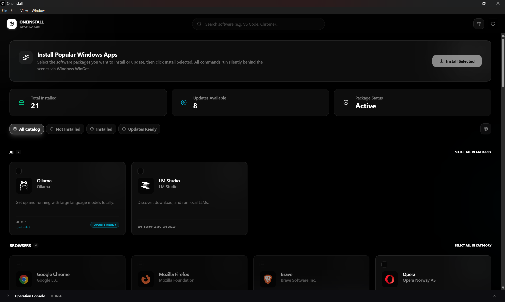
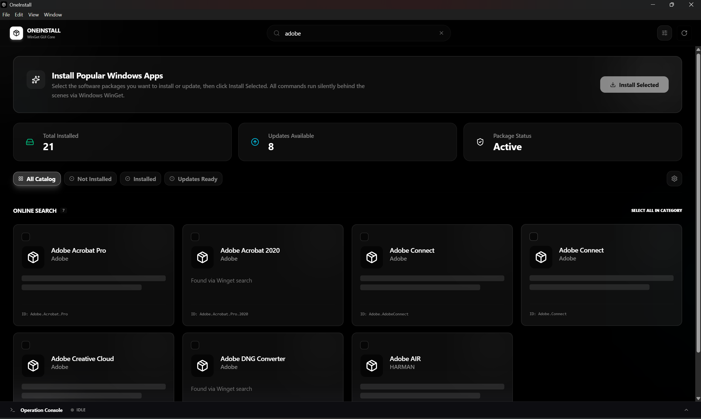
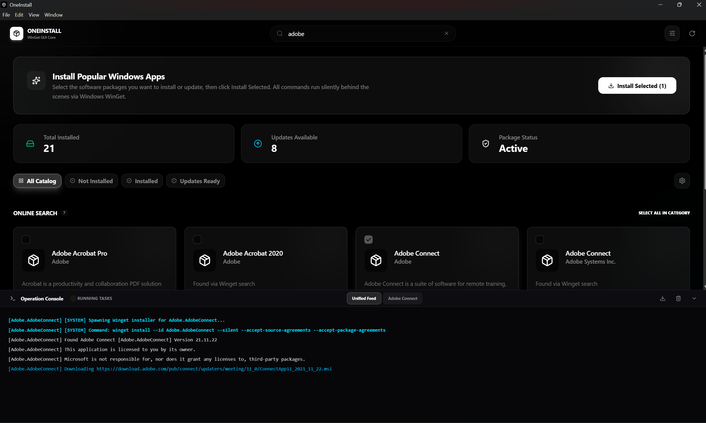

# OneInstall

<p align="center">
  
</p>

<h1 align="center">OneInstall</h1>

<p align="center">
  <strong>A modern Windows package manager built with Electron, React, TypeScript and Winget.</strong>
</p>

<p align="center">
  Search, discover and install Windows applications with a beautiful and intuitive interface.
</p>

<p align="center">

[](https://github.com/Snokei/OneInstall/releases/latest)
[](https://github.com/Snokei/OneInstall/releases/latest)
[](https://github.com/Snokei/OneInstall/stargazers)
[](LICENSE)

</p>

<p align="center">
  <a href="https://github.com/Snokei/OneInstall/releases/latest">
    
  </a>
</p>

---

# ✨ Features

- 🚀 One-click application installation
- 🔍 Fast package search
- ⭐ Favorite applications
- 📦 Batch installation support
- 🎨 Modern and clean interface
- ⚡ Powered by Windows Package Manager (Winget)
- 💻 Windows 10 & Windows 11 support
- 🌙 Light & Dark mode
- 🔄 Fast package management
- ❤️ Completely Free & Open Source

---

# 📸 Screenshots

## 🏠 Home

<p align="center">
    
</p>

---

## 🔍 Search

<p align="center">
    
</p>

---

## 📦 Installation

<p align="center">
    
</p>

---

# 🚀 Download

Download the latest version from GitHub Releases.

👉 **https://github.com/Snokei/OneInstall/releases/latest**

---

# 🛠 Built With

- Electron
- React 19
- TypeScript
- Vite
- Tailwind CSS
- Zustand
- Windows Package Manager (Winget)

---

# ⚡ Getting Started

## Clone Repository

```bash
git clone https://github.com/Snokei/OneInstall.git
cd OneInstall
```

## Install Dependencies

```bash
npm install
```

## Run Development

```bash
npm run electron:dev
```

## Build Production

```bash
npm run dist
```

The generated installer will be available inside:

```
release/
```

---

# 📦 Requirements

- Windows 10 (1809+) or Windows 11
- Windows Package Manager (Winget)
- Internet connection

---

# 📁 Project Structure

```
OneInstall
│
├── assets/
│   ├── home.png
│   ├── install.png
│   └── search.png
│
├── build/
├── dist/
├── dist-electron/
├── electron/
├── public/
├── src/
│   ├── components/
│   ├── data/
│   ├── hooks/
│   ├── layouts/
│   ├── pages/
│   ├── store/
│   ├── SVG/
│   ├── types/
│   ├── App.tsx
│   └── main.tsx
│
├── package.json
└── README.md
```

---

# 🚀 Roadmap

- ✅ Search applications
- ✅ Install applications
- ✅ Favorites
- ✅ Batch installation
- ✅ Modern UI
- ⏳ Update installed applications
- ⏳ Uninstall applications
- ⏳ Categories
- ⏳ Export / Import favorites
- ⏳ Package details
- ⏳ Automatic updates
- ⏳ Multi-language support

---

# 🤝 Contributing

Contributions are always welcome.

1. Fork the repository

2. Create a feature branch

```bash
git checkout -b feature/my-feature
```

3. Commit your changes

```bash
git commit -m "Added awesome feature"
```

4. Push to GitHub

```bash
git push origin feature/my-feature
```

5. Open a Pull Request

---

# 🐞 Report Issues

Found a bug or have a feature request?

Please create an issue here:

https://github.com/Snokei/OneInstall/issues

---

# ❤️ Why OneInstall?

OneInstall provides a modern interface for Microsoft's Windows Package Manager (Winget), making software installation easier and more accessible.

Instead of memorizing package names or typing commands in the terminal, users can browse, search and install applications with just a few clicks.

Perfect for:

- 👨‍💻 Developers
- 🎮 Gamers
- 🎨 Designers
- 🏢 Office users
- 🎓 Students

---

# ⭐ Support

If you like OneInstall, please consider:

⭐ Starring the repository

🐞 Reporting bugs

💡 Suggesting new features

❤️ Sharing it with others

Every contribution helps improve the project.

---

# 📄 License

This project is licensed under the MIT License.

---

# 👨‍💻 Author

**Neel**

GitHub

https://github.com/Snokei

---

<p align="center">

Made with ❤️ using Electron, React & TypeScript

</p>
